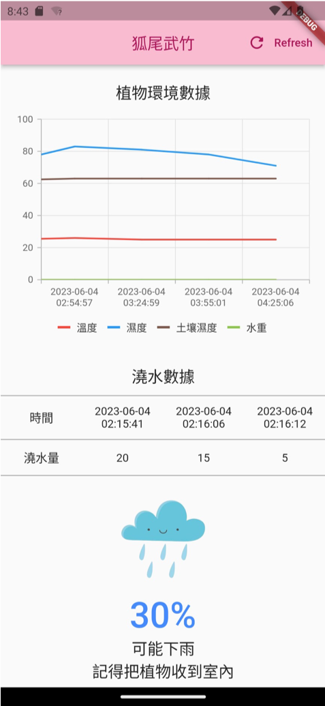

# Plant Watering

## 介紹
* 物聯網期末專題
* 利用此手機應用程式來關注植物及環境資訊
* 植物及環境資訊每半小時進行監測

## 應用程式

* 最上層：重新整理資料
* 上層：植物環境資訊(保留最近十筆，可以左右滑動查看)
* 中層：最近三次澆水紀錄
* 下層：最近天氣狀況，視降雨機率提醒使用者是否該收進來避雨或拿出去曬太陽

## 貢獻
* [楊世宇](https://github.com/Edmond-Yang)
* [楊峻豪](https://github.com/daaaaaaavid)
* [林庭毅](https://github.com/TingYeeet)
* [陳建維](https://github.com/TamakiSilSha)
